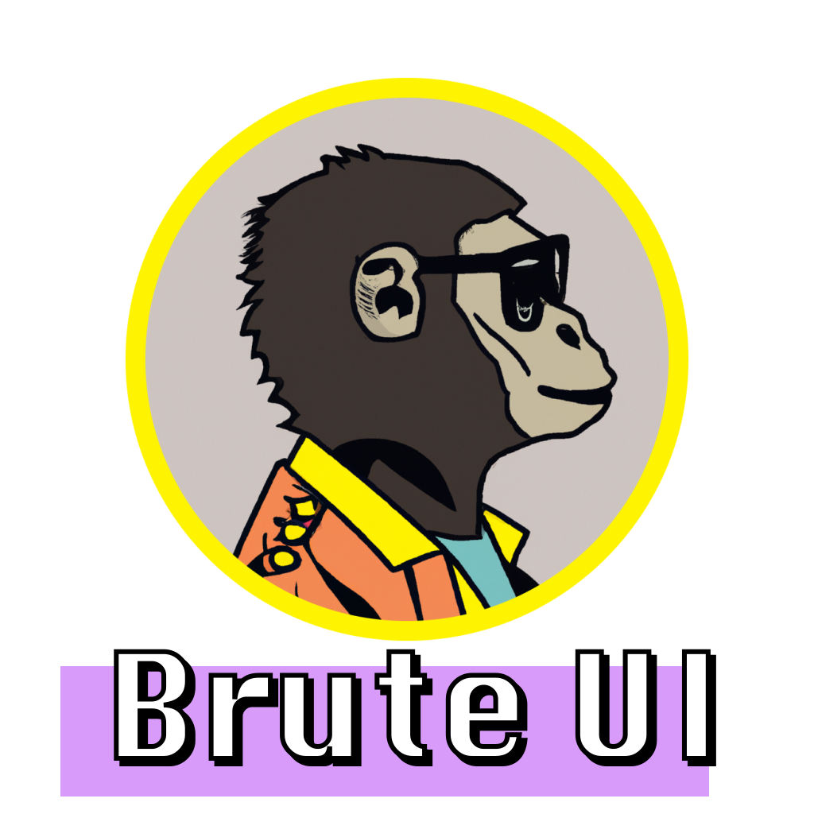

# Brute-UI

Brute-UI is a React UI component library that embraces the neo-brutalist design movement. The library provides a set of high-quality components that are functional, minimalistic, and unapologetically raw in appearance. 

## Getting Started

To use Brute-UI in your project, simply run the following command in your project's root directory:

`npm install brute-ui`

Once the library has been installed, you can import the components you need in your React application. Here's an example of how you can use the `Button` component:

`import React from 'react';
import { Button } from 'brute-ui';

function App() {
return (
<Button>Click Me</Button>
);
}

export default App;`

## Components

Brute-UI provides the following components:

- Button
- Card
- Icon
- Input
- Layout
- List
- Modal
- Typography

## Contributing

We welcome contributions to Brute-UI! If you have an idea for a new component or have found a bug, please open an issue on GitHub. If you would like to submit a pull request, please make sure to follow our contribution guidelines.

## License

Brute-UI is open source software licensed under the MIT license.
